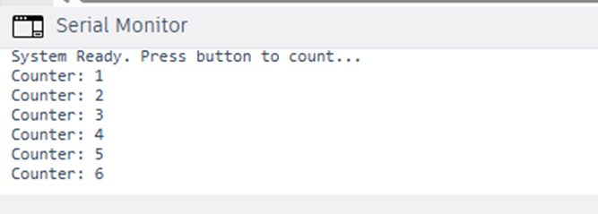

#include <avr/io.h>
#include <util/delay.h>
#include <stdio.h>

// Definitions for UART communication
#define F_CPU 16000000UL
#define BAUD 9600
#define MYUBRR F_CPU/16/BAUD-1

void UART_init(unsigned int ubrr) {
    UBRR0H = (unsigned char)(ubrr>>8);
    UBRR0L = (unsigned char)ubrr;
    UCSR0B = (1<<TXEN0); // Enable transmitter
    UCSR0C = (3<<UCSZ00); // 8-bit data format
}

void UART_transmit(unsigned char data) {
    while (!(UCSR0A & (1<<UDRE0))); // Wait for empty buffer
    UDR0 = data;
}

void UART_print(char* s) {
    while(*s) UART_transmit(*s++);
}

int main(void) {
    // Hardware Configuration
    DDRD &= ~(1 << PD2);     // Set PD2 (Pin 2) as Input
    PORTD |= (1 << PD2);    // Enable Internal Pull-up Resistor
    
    UART_init(MYUBRR);
    UART_print("System Ready. Press button to count...\r\n");

    int count = 0;
    int last_state = 1; // High due to pull-up
    char buffer[32];

    while (1) {
        // Read current state of Pin D2
        int current_state = (PIND & (1 << PD2));

        // Detect Falling Edge (Button pressed: State goes from 1 to 0)
        if (current_state == 0 && last_state != 0) {
            _delay_ms(50); // Software Debounce Delay
            
            // Re-verify the button is still pressed
            if (!(PIND & (1 << PD2))) {
                UDR0 = data;
}

void UART_print(char* s) {
    while(*s) UART_transmit(*s++);
}

int main(void) {
    // Hardware Configuration
    DDRD &= ~(1 << PD2);     // Set PD2 (Pin 2) as Input
    PORTD |= (1 << PD2);    // Enable Internal Pull-up Resistor
    
    UART_init(MYUBRR);
    UART_print("System Ready. Press button to count...\r\n");

    int count = 0;
    int last_state = 1; // High due to pull-up
    char buffer[32];

    while (1) {
        // Read current state of Pin D2
        int current_state = (PIND & (1 << PD2));

        // Detect Falling Edge (Button pressed: State goes from 1 to 0)
        if (current_state == 0 && last_state != 0) {
            _delay_ms(50); // Software Debounce Delay
            
            // Re-verify the button is still pressed
            if (!(PIND & (1 << PD2))) {
                count++;
                sprintf(buffer, "Counter: %d\r\n", count);
                UART_print(buffer);
            }
        }
        
        last_state = current_state; // Save state for next iteration
    }
}

                count++;
                sprintf(buffer, "Counter: %d\r\n", count);
